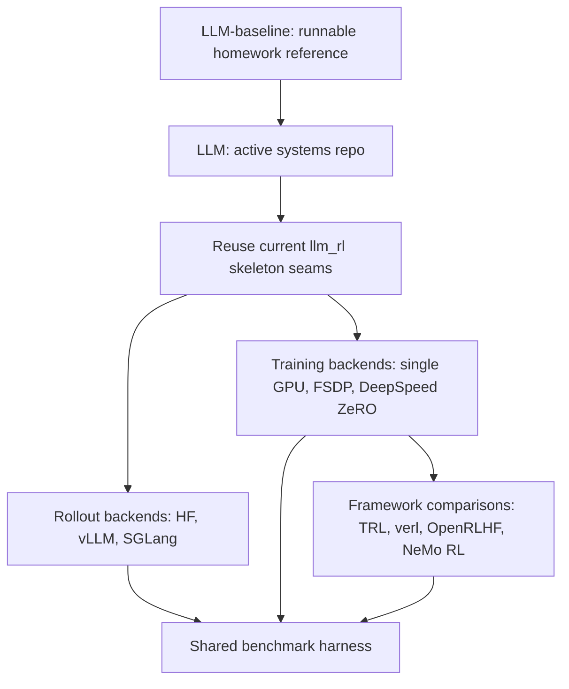

# LLM Roadmap

## Target direction

## Phased roadmap

## Phase 0: Freeze the baseline

Purpose: keep one trustworthy reference implementation.

Actions:

- Treat `RL/LLM-baseline` as the source of truth for the original homework behavior.
- Do not add new rollout or training features there unless they are strictly needed to keep the baseline runnable.
- Use it for correctness checks and performance comparison.
- Use `RL/LLM-baseline/archive/current-vllm-modified-homework-tree/` as a reference source for previously attempted acceleration work, not as the default baseline.

Exit criteria:

- `RL/LLM-baseline` continues to run `python -m hw4.train`.

## Phase 1: Make `RL/LLM` a standalone trimmed repo

Purpose: convert the copied skeleton into an intentional project.

Actions:

- Add `pyproject.toml`, `.gitignore`, `.python-version`, and `README.md` to `RL/LLM`.
- Keep `llm_rl` as the active package name so the repo no longer carries the homework-specific module name.
- Define where artifacts should live for the active repo.
- Document the difference between baseline outputs and active experiment outputs.

Recommended artifact policy:

- Put active-repo outputs under a clearly owned path such as `RL/LLM/runs/` or `RL/benchmarks/`.
- Avoid writing new artifacts into `RL/LLM-baseline` unless the run is intentionally a baseline run.

Exit criteria:

- `RL/LLM` can run `python -m llm_rl.train --help`.
- `RL/LLM` has its own environment/bootstrap files.
- The active repo is documented without relying on course instructions.

## Phase 2: Harden the core abstractions

Purpose: prepare the current skeleton for backend swapping without rewriting everything at once.

Actions:

- Keep `Sampler`, `RolloutOutput`, `RolloutBatch`, and `RLAlgorithm` as the first-class interfaces.
- Separate orchestration concerns in `llm_rl/train.py` into clearer responsibilities:
  - config parsing
  - model/bootstrap
  - rollout
  - reward calculation
  - optimization/update
  - checkpointing
  - evaluation
- Decide which current files are truly core and which are legacy carryovers.
- Mark `llm_rl/gradescope_bundle.py` as legacy, or move it later to a `legacy/` or `archive/` area in the active repo.
- Replace homework-style TODO comments with an engineering backlog document or issue list.

Design rule:

- Keep the active repo simple enough that a new rollout backend or training backend can be added without rewriting the entire training loop.

Exit criteria:

- The control flow in `llm_rl/train.py` is easier to understand and extend.
- Core interfaces are explicit enough to support multiple backends.v

## Phase 3: Reintroduce fast rollout backends

Purpose: speed up the expensive autoregressive generation path first.

Why this phase comes before distributed training:

- In this project shape, rollout is the clearest bottleneck to attack first.
- The archived modified tree already proved this direction is practical.
- Rollout backends fit the existing `Sampler` abstraction better than training backends fit the current single-file trainer.

Implementation order:

1. Keep `hf` rollout as the debug/reference backend.
2. Introduce `vllm` generation into `RL/LLM` using the archived modified tree as reference.
3. (Optional for later) Add `sglang` as a second accelerated rollout backend behind the same interface.

Important design upgrade:

- Evolve `RolloutOutput` so that future rollout engines can return token-aligned outputs, not only decoded text.
- This avoids repeated re-tokenization and reduces mismatch risk between external generation engines and the HF training model.

Expected outcome:

- `hf` remains the correctness backend.
- `vllm` becomes the first accelerated rollout backend.
- `sglang` becomes the second comparison backend.

Exit criteria:

- `RL/LLM` can switch rollout backends via config.
- Benchmark runs compare `hf` vs `vllm` vs `sglang` on the same task/model settings.

Bugs (Training run of math-grpo): 

- After using vLLM to sample. I noticed higher **train/policy_token_entropy_mean_over_minibatches, olicy_loss_with_kl_penalty_mean_over_minibatches** given the same step count as baseline training.
- At step 100, rollout token per second had a larger variance. The minimum value drops to 1200 ish
- Grad Norm after clipping is also higher. approximate_kl_divergence_policy_vs_reference_mean_over_minibatches is also higher. 
- Overall high entropy in the rollout phase. 
- Use vLLM for samplign tokens and discard its logprobs. Re-tokenize the generated text and compute logprobs via HF forward pass. However, HF and vLLM uses different tokenizers, the mismatch exacerbates over 500 steps

## Phase 4: Add distributed training backends

Purpose: compare memory scalability and step throughput on the training side.

Recommended order:

1. FSDP first
2. DeepSpeed ZeRO second

Why FSDP first:

- It is closer to plain PyTorch and easier to reason about in the current repo.
- It fits a gradual migration better than jumping straight into a larger runtime stack.
- It is the best next step if the goal is to understand the mechanics of distributed RL training.

What FSDP work actually requires:

- distributed initialization
- rank-aware device setup
- rank-aware logging and checkpoint saving
- safe adapter saving from wrapped models
- evaluation behavior under sharded training
- clear interaction between gradient accumulation and distributed execution

What DeepSpeed ZeRO work actually requires:

- engine-managed backward and optimizer stepping
- sharded optimizer state handling
- checkpoint compatibility decisions
- a cleaner separation between training and generation, especially when generation is offloaded to `vllm` or `sglang`

Design rule:

- Treat rollout backend choice and training backend choice as orthogonal dimensions.

Desired backend matrix:

- `HF + single GPU`
- `vLLM + single GPU trainer`
- `SGLang + single GPU trainer`
- `vLLM + FSDP`
- `SGLang + FSDP`
- `vLLM + DeepSpeed ZeRO`
- `SGLang + DeepSpeed ZeRO`

Exit criteria:

- The active repo can run at least one distributed trainer plus one accelerated rollout backend.
- Checkpointing and evaluation remain stable across backends.

## Phase 5: Compare external frameworks instead of only growing the native repo

Purpose: learn the broader ecosystem and avoid overfitting to one local architecture.

This phase is not about replacing the native repo immediately. It is about understanding where the custom code should stop and where existing frameworks become more efficient.

### TRL

Use for:

- fastest external baseline
- Hugging Face-native experiments
- quick GRPO/PPO-style comparisons close to the existing code style

Why it matters:

- Lowest abstraction jump from the current code.
- Good for validating ideas before moving to heavier infrastructure.

### verl

Use for:

- the most interesting backend comparison framework for this project
- experiments that compare FSDP, Megatron-LM, `vllm`, and `sglang` under one RL framework

Why it matters:

- Best match for the goal of learning multiple rollout/training combinations.
- Likely the strongest external framework to compare against the native repo once the active repo is stable.

### OpenRLHF

Use for:

- more production-style RLHF architecture
- Ray + `vllm` + DeepSpeed-style experimentation

Why it matters:

- Closer to actor/learner/service-style system design than the native repo.
- Useful once you want to study orchestration and larger-scale training workflows.

### NeMo RL

Use for:

- NVIDIA-native scale-up path
- multi-node or Megatron-oriented post-training

Why it matters:

- Strong option if the target environment becomes H100/H200 clusters and larger-model post-training.
- Most valuable when cluster-scale experimentation becomes the priority rather than minimal local code churn.

### Optional related tools worth considering

- `Accelerate` for lightweight distributed bootstrap and launcher ergonomics
- `Ray` for experiment orchestration when actor/rollout services grow
- `Megatron-LM` if model scale becomes much larger
- `Liger Kernel`, FlashAttention, and compile/profiling tools for lower-level speed work

## Recommended learning order

This is the suggested order if the goal is both understanding and speed:

1. Make `RL/LLM` standalone and runnable.
2. Keep `RL/LLM-baseline` as the correctness/speed reference.
3. Reintroduce `vllm` rollout into `RL/LLM`.
4. Add a benchmark harness and compare against the baseline.
5. Add `sglang` rollout.
6. Add FSDP training support.
7. Add DeepSpeed ZeRO training support.
8. Run a small TRL-based comparison as the lowest-friction external framework check.
9. Compare the native repo against `verl`.
10. Explore OpenRLHF and NeMo RL once the project is ready for more infrastructure-heavy experiments.

Why this order:

- It preserves a working reference.
- It attacks the easiest and most meaningful performance seam first.
- It avoids introducing too many moving pieces at the same time.

## Benchmark plan

The benchmark plan should compare both speed and quality.

### Core metrics

- rollout tokens/sec
- optimizer/update tokens/sec
- wall-clock step time
- examples/sec
- GPU memory allocated/reserved/peak
- checkpoint size and checkpoint time
- evaluation quality on `format_copy`
- evaluation quality on `math_hard`
- startup time and operational complexity

### Benchmark tiers

#### Tier 1: smoke tests

Use for fast validation after every structural change.

- `format_copy`
- short step count
- small batch/group sizes
- single GPU

#### Tier 2: medium integration tests

Use for backend comparisons without paying full production cost.

- `math_hard`
- reduced steps
- same model, prompt length, and sampling settings across backends

#### Tier 3: full comparison runs

Use only after the active repo is stable.

- longer `math_hard` runs
- compare HF baseline, accelerated rollout, and distributed training stacks

### Benchmark discipline

- Always compare against the same baseline model and LoRA settings.
- Keep rollout settings fixed when comparing rollout engines.
- Keep rollout engine fixed when comparing training backends.
- Record exact environment details: GPU type, CUDA/PyTorch versions, and dependency set.

## Concrete near-term tasks for `RL/LLM`

These are the next practical tasks implied by the current tree:

1. Add active-repo bootstrap files: `pyproject.toml`, `.gitignore`, `.python-version`, `README.md`.
2. Decide whether `llm_rl/gradescope_bundle.py` stays temporarily or moves to legacy.
3. Re-enable the active repo as a runnable project from its own root.
4. Bring back `vllm` rollout carefully from `RL/LLM-baseline/archive/current-vllm-modified-homework-tree/`.
5. Define a stable benchmark folder layout and logging policy.
6. Only then start adding FSDP and DeepSpeed backends.

## Success criteria

This roadmap is successful when:

- `RL/LLM-baseline` remains a clean runnable homework reference.
- `RL/LLM` becomes a self-contained repo rather than a loose code copy.
- `RL/LLM` can run the reused skeleton code intentionally.
- `RL/LLM` can compare at least two rollout backends and at least two training backends.
- Framework comparisons are grounded in a shared benchmark harness rather than ad hoc impressions.

